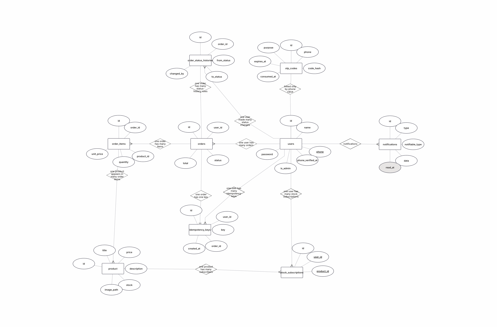
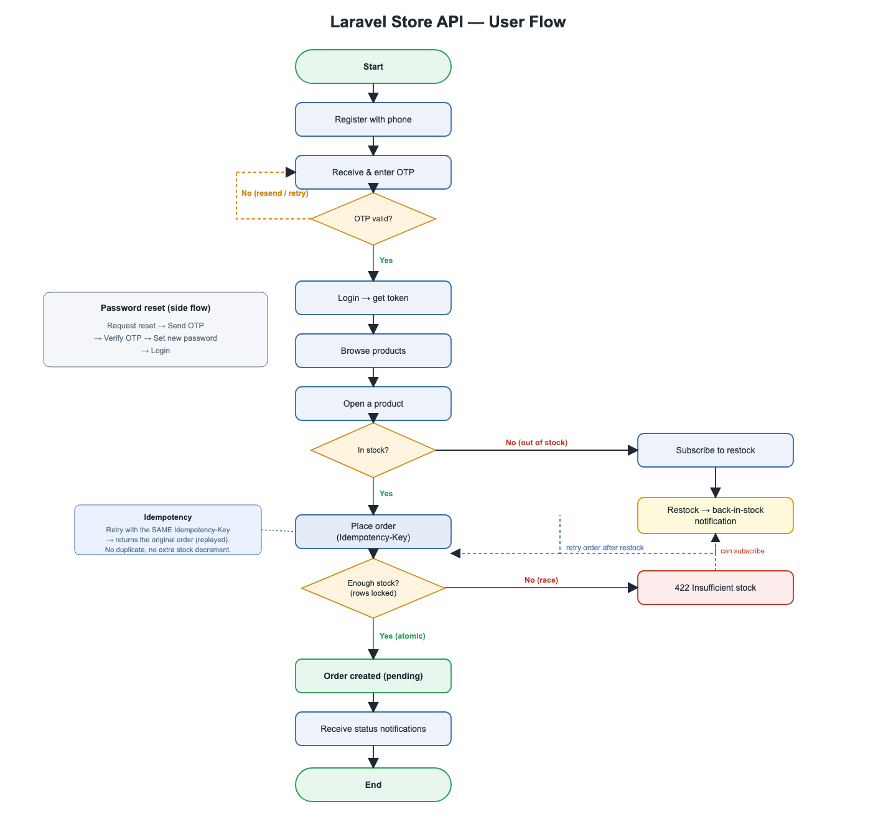
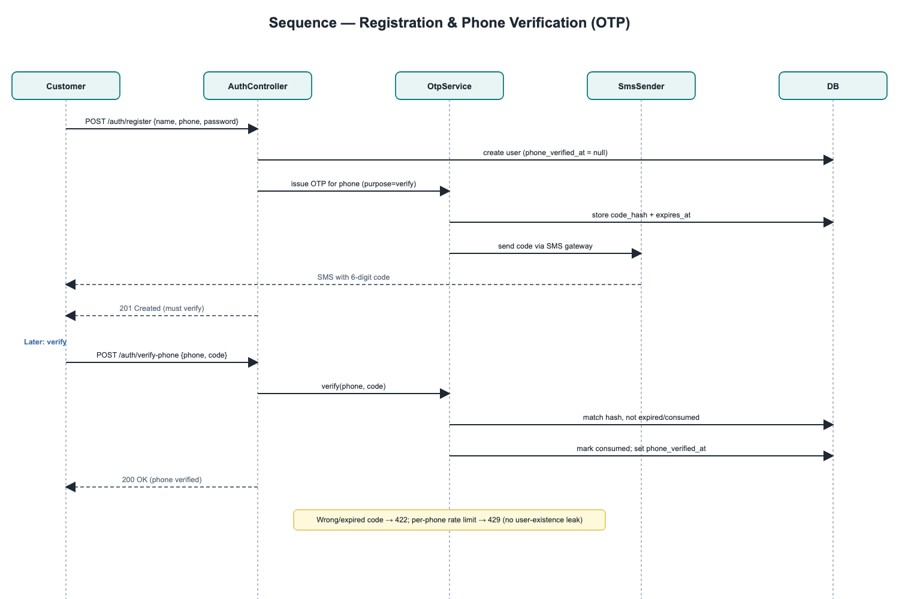

# Store API

A REST-only backend for a small online store, built with **Laravel 13**. It provides
phone-number authentication, admin product management with image upload, a queue-backed
notification system, and concurrency-safe order processing with a full status workflow.

---

## Requirements

- PHP **8.2+** (developed on 8.3)
- Composer 2
- SQLite (bundled with PHP) — no external database server needed for development or tests

The stack is database-driven for queues, cache and notifications, so nothing else is
required to run locally. For production you can point `DB_CONNECTION` at MySQL/Postgres
and `QUEUE_CONNECTION`/`FILESYSTEM_DISK` at real infrastructure without code changes.

---

## Setup

```bash
# 1. Install dependencies
composer install

# 2. Environment
cp .env.example .env
php artisan key:generate

# 3. Database (SQLite) + seed the admin account
touch database/database.sqlite
php artisan migrate --seed

# 4. Storage symlink so uploaded product images are publicly served
php artisan storage:link
```

### Running

```bash
# API server
php artisan serve                 # http://localhost:8000

# Queue worker — REQUIRED for notifications to be delivered
php artisan queue:work
```

Notifications (new product, back-in-stock, order status) are dispatched to the **database
queue** and processed by the worker, so they never delay an API response. If you don't run
`queue:work`, the API still works but queued notifications stay pending.

### Tests

```bash
php artisan test
```

The suite runs against an in-memory SQLite database (configured in `phpunit.xml`) and is
fully self-contained — **83 tests / 269 assertions**.

---

## Seeded admin

`php artisan migrate --seed` (or `php artisan db:seed`) creates an admin account from
`config/store.php` / your `.env`:

| Field | Env var | Default |
| --- | --- | --- |
| Phone | `ADMIN_SEED_PHONE` | `+10000000001` |
| Password | `ADMIN_SEED_PASSWORD` | `password` |

The admin is created already phone-verified, so you can log in immediately and receive a
token.

---

## Authentication flow

Authentication uses **Laravel Sanctum** bearer tokens. The account identity is the phone
number.

1. `POST /api/auth/register` — creates the account and sends a 6-digit verification code.
2. The code is delivered through the configured SMS gateway. In development the gateway is
   `LogSmsSender`, so **the code is written to `storage/logs/laravel.log`** (look for
   `SMS dispatched`). Swap in a real provider by binding `App\Services\Sms\SmsSender` in
   `AppServiceProvider`.
3. `POST /api/auth/verify-phone` — confirms the phone. Login is blocked until this is done.
4. `POST /api/auth/login` — returns a token. Send it as `Authorization: Bearer <token>` on
   protected routes.

Forgot your password? `POST /api/auth/password/forgot` sends a reset code, then
`POST /api/auth/password/reset` sets a new password and revokes all existing tokens.

---

## API endpoints

All endpoints are under `/api` and return JSON. Protected routes require
`Authorization: Bearer <token>`.

### Auth
| Method | Endpoint | Auth | Description |
| --- | --- | --- | --- |
| POST | `/auth/register` | – | Register with a phone number |
| POST | `/auth/login` | – | Get a bearer token |
| POST | `/auth/logout` | ✔ | Revoke the current token |
| POST | `/auth/verify-phone/request` | – | Send/resend a verification code |
| POST | `/auth/verify-phone` | – | Verify the phone number |
| POST | `/auth/password/forgot` | – | Send a password reset code |
| POST | `/auth/password/reset` | – | Reset the password |

### Products
| Method | Endpoint | Auth | Description |
| --- | --- | --- | --- |
| GET | `/products` | ✔ | List products (search, price/stock filters, sort, pagination) |
| GET | `/products/{id}` | ✔ | Show a product |
| POST | `/products` | admin | Create a product (multipart, with image) |
| PUT/PATCH | `/products/{id}` | admin | Update a product |
| DELETE | `/products/{id}` | admin | Delete a product |
| POST | `/products/{id}/notify-me` | ✔ | Subscribe to a back-in-stock alert (out-of-stock only) |

### Orders
| Method | Endpoint | Auth | Description |
| --- | --- | --- | --- |
| GET | `/orders` | ✔ | List orders (own for users, all for admin; status/user filters, sort) |
| GET | `/orders/{id}` | owner/admin | Show an order |
| POST | `/orders` | ✔ | Place an order (optional `Idempotency-Key` header) |
| PATCH | `/orders/{id}/status` | admin | Change order status |

### Notifications
| Method | Endpoint | Auth | Description |
| --- | --- | --- | --- |
| GET | `/notifications` | ✔ | The user's own notifications |
| PATCH | `/notifications/{id}/read` | ✔ | Mark a notification as read |

A full request/response contract — headers, bodies, and example success **and** error
responses — is in the Postman collection at
[`docs/postman_collection.json`](docs/postman_collection.json). Import it into Postman and
set the `base_url`, `token`, and `admin_token` collection variables.

---

## Diagrams

> 📬 **Postman collection:** [`docs/postman_collection.json`](docs/postman_collection.json) — import it into
> Postman to exercise every endpoint above (variables: `base_url`, `token`, `admin_token`).

### Entity-relationship diagram
All 9 domain tables and how they connect: `users` and `products` as the two hubs,
`orders` as the central transaction, `order_items`/`stock_subscriptions` as the
many-to-many join tables, `idempotency_keys`/`order_status_histories` hanging off
`orders`, and `otp_codes` linked to `users` only by the `phone` value (no FK).



### Use case diagram
Customer and Admin actors against the Store API, including `«include»` relationships
(registration/password-reset both include *Send OTP*; *Place Order* includes the atomic
*Reserve Stock* step) and the Admin-is-a-User generalization.


### User flow
The end-to-end customer journey: register → verify phone (OTP, with retry) → login →
browse → place an order → atomic stock check → order created → status notifications,
with the out-of-stock/restock-subscription branch, the idempotent-retry branch, and the
password-reset side flow.



### Sequence — registration & phone verification (OTP)
Customer → `AuthController` → `OtpService` → `SmsSender` → DB, from account creation
through code delivery and verification, including the rate-limit/no-existence-leak note.



### Sequence — place order (idempotent + atomic stock)
Customer → `OrderController` → `OrderService` → DB. Shows the `alt [key already used] /
else [new request]` idempotency branch, the `SELECT ... FOR UPDATE` row lock, and the
rollback-on-insufficient-stock path — this mirrors `OrderService::place()` exactly.


---

## Design decisions

### Events, Listeners and Observers
The domain uses each Laravel primitive where it fits best:

| Primitive | Where | Why |
| --- | --- | --- |
| **Observer** | `ProductObserver@updated` | Detects the out-of-stock → in-stock transition from a normal product update. Detection belongs to the model lifecycle, so an observer is the natural home; it holds *only* detection and raises `ProductRestocked`. |
| **Event + Listener** | `ProductCreated` → `SendNewProductNotifications` | Notify all verified customers of a new product, off the request cycle. |
| **Event + Listener** | `ProductRestocked` → `SendBackInStockNotifications` | Notify only the subscribers of a restocked product. |
| **Event + Listener** | `OrderStatusChanged` → `SendOrderStatusNotification` | Notify the order owner when their order's status changes. |

All listeners are `ShouldQueue` + `afterCommit`.

### Notifications never block or corrupt the response
- Every fan-out runs on a **queued** listener dispatched **after** the database
  transaction commits, so the API response returns immediately and a notification failure
  can never roll back the product/order operation.
- **Retries are safe.** Each listener de-duplicates:
  - *New product* — skips users already notified for that product.
  - *Back in stock* — claims each subscription by deleting it *before* sending, so a retry
    or a concurrent worker finds the row gone and never notifies twice.
  - *Order status* — de-duplicates on the status-history id.

### Stock integrity & concurrency
- Order creation runs in a single transaction that locks the product rows with
  `lockForUpdate` (in a stable id order to avoid deadlocks). The read → check → decrement
  is serialised, so stock can never be oversold.
- It is **all-or-nothing**: if any requested quantity is short, the whole transaction rolls
  back — no order, no items, no partial stock change (`422 Insufficient stock.`).
- Row-level locking is enforced on MySQL/Postgres; SQLite serialises writers, which also
  prevents oversell in development/tests.
- **Unit price is snapshotted** on each order item, so later product price edits never
  change an existing order's totals. Money is computed with bcmath.

### OTP security
- Codes are 6 digits, generated with a CSPRNG, **stored only as a bcrypt hash**, single-use,
  and expire after `OTP_TTL_MINUTES` (default 10). Issuing a new code invalidates the
  previous one, and codes are scoped by purpose (a verification code can't reset a
  password). The plain code is returned by **no** API response.
- OTP issuance is **rate limited per phone number** (`429` after `OTP_MAX_PER_WINDOW`), and
  request/forgot endpoints return an identical response whether or not the phone exists, so
  they cannot be used to enumerate accounts.

### Order status workflow
- Allowed transitions: `pending → confirmed → processing → shipped → delivered`, with
  `cancelled` reachable from any non-terminal state. `delivered` and `cancelled` are
  terminal. Illegal transitions return `422`.
- **Resubmitting the current status is a no-op**: no history row, no event, no notification.
- Every real change writes an immutable history row (`from`, `to`, `changed_by`,
  `created_at`) in the same transaction as the status update.

### Authorization
- Sanctum protects every non-public route (`401` when unauthenticated).
- `ProductPolicy` restricts writes to admins; `OrderPolicy` restricts an order to its owner
  or an admin, and status changes to admins. Regular users get `403`, never a silent
  success.

### Assumptions
- Cancelling an order does **not** restock its items (out of scope; would be a deliberate
  business decision).
- A user requesting another user's order receives `403` (the order exists but isn't theirs)
  rather than `404`.
- Admins are provisioned by seeding, not via a public endpoint.

---

## Project layout highlights

```
app/
  Enums/            OrderStatus (transition map), OtpPurpose
  Events/           ProductCreated, ProductRestocked, OrderStatusChanged
  Listeners/        queued notification fan-out (one per event)
  Observers/        ProductObserver (restock detection)
  Notifications/    database notifications
  Policies/         ProductPolicy, OrderPolicy
  Services/
    Sms/            SmsSender contract + LogSmsSender (swappable gateway)
    Otp/            OtpService (hashing, expiry, rate limiting)
    Orders/         OrderService (atomic stock), OrderStatusService
config/store.php    OTP, SMS-sender and admin-seed settings
docs/postman_collection.json
```
